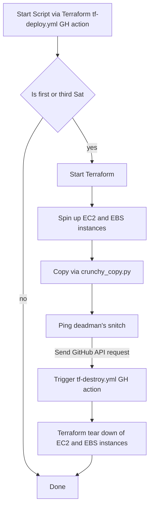

A Python script used to transfer backups stored on the CrunchyBridge S3 Bucket to AspirEDU's S3 Bucket.

## Contributing

Install dependencies

```bash
python -m venv venv
source venv/bin/activate
pip install -r requirements.txt
```

Install pre-commit hooks:

```bash
pre-commit install
```

### Updating Python dependencies

```bash
source venv/bin/activate
pip-compile --upgrade
```

## Re-running a failed backup

Occasionally backups will fail. To re-run them, you can start a
[\[Adhoc\] Start Script via Terraform GitHub Action](https://github.com/aspiredu/crunchy-backups/actions/workflows/tf-deploy-adhoc.yml)
by clicking on "Run Workflow".

There are three inputs you'll need to populate:

1. Branch (`main` is what you should use unless you know different)
2. Database (the database that failed)
3. Working dir (`us-east` for most databases, `aspiredu-au` needs `au`)
4. Backup target (the date in the format YYYYMMDD)


## Testing Locally

1. Ensure the [Terraform CLI](https://developer.hashicorp.com/terraform/downloads) is installed. The
   following command should output the currently installed version of the Terraform CLI:

```
terraform --version
```

2. Create a new `.env.terraform file` with the following content:

```
export TF_VAR_CRUNCHY_TEAM_ID=CRUNCHY_TEAM_ID
export TF_VAR_CRUNCHY_API_KEY=CRUNCHY_API_KEY
export TF_VAR_ASPIRE_AWS_ACCESS_KEY_ID=YOUR_AWS_ACCESS_KEY
export TF_VAR_ASPIRE_AWS_SECRET_ACCESS_KEY=YOUR_AWS_SECRET_KEY
export TF_VAR_GIT_PAT=GIT_PERSONAL_ACCESS_TOKEN
export TF_VAR_ASPIRE_CLUSTER=ASPIRE_CLUSTER_TO_RUN_FOR
export AWS_ACCESS_KEY_ID="$TF_VAR_ASPIRE_AWS_ACCESS_KEY_ID"
export AWS_SECRET_ACCESS_KEY="$TF_VAR_ASPIRE_AWS_SECRET_ACCESS_KEY"
```

- [AWS access key docs](https://docs.aws.amazon.com/IAM/latest/UserGuide/id_credentials_access-keys.html#Using_CreateAccessKey)
- [GitHub Personal Access Token (PAT) docs](https://docs.github.com/en/authentication/keeping-your-account-and-data-secure/managing-your-personal-access-tokens)

3. Load the environment variables from the file with the following command:

```shell
source .env.terraform
```

4. Navigate to the directory in this repository for the region to use for testing (likely `us-east`).

5. Initialize Terraform with the following command:

```
terraform init -backend-config="key=$TF_VAR_ASPIRE_CLUSTER/terraform.tfstate"
```

6. (Optional but recommended) Verify the actions Terraform will take when applied with the following command:

```
terraform plan
```

7. Run the following command to apply the changes from Step 6 and provision the specified resources from AWS:

```
terraform apply
```

8. The EC2 Instance will be provisioned by Terraform along with the supporting Volume for storage. The state can be
   viewed through the AWS Web Portal. Connect to the EC2 Instance via SSH (instructions can be found on the AWS Web
   Portal).

Note: Accessing the instance via SSH requires the `.pem` private key file corresponding to the AWS Key Pair used by
Terraform when provisioning the EC2 instance.

9. Verify the volume was mounted at the correct point in the file structure, verify the file structure itself is as
   expected, and check that the Python script is running. Here are a few useful commands:

View Attached Drives with Filesystem and Mount Points

```
lsblk -f
```

View Running Processes

```
htop
```

View Start-Up Script Sent to Userdata

```
curl http://169.254.169.254/latest/user-data
```

The logs for the Start-Up Script can be found at `/var/log/cloud-init-output.log`.

## Process overview

This process uses GitHub actions and Terraform to control AWS EC2 instances that
copy our backups between S3 buckets.



## Restore process

See our (Database Developer docs)[https://github.com/aspiredu/aspiredu/blob/main/docs/docs/dev/database.rst]
